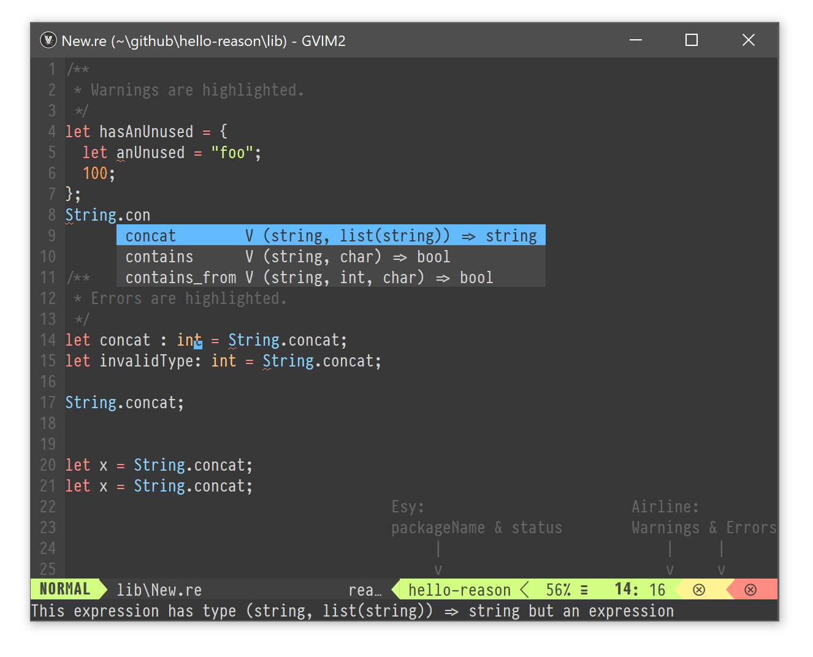

vim-reasonml:
=========================================

**vim-reasonml: Native development with `esy` and Merlin**



## Install

- `npm install -g esy`
- Create a project with `@opam/merlin` as a `devDependency`.
You can fork [hello-reason](https://github.com/esy-ocaml/hello-reason) to get started.
- `esy intsall && esy build` as you normally would.
- Add this plugin to your Vim (for example if you use
  [`vim-plug`](https://github.com/junegunn/vim-plug), then add `Plug 'jordwalke/vim-reason'` to your `~/.vimrc`)
- Open a `.re` file from the project in Vim.


## Formatting

The command `:ReasonPrettyPrint` invokes the binary `refmt` which must be
available on your `PATH`.  Add a keyboard mapping shortcut like this:

```vim
autocmd FileType reason map <buffer> <D-C> :ReasonPrettyPrint<Cr>
```

## Syntastic Support
To enable syntastic support, add the following to your `~/.vimrc`:

```
" If using vim-plug, install syntastic:
Plug 'scrooloose/syntastic'
let g:syntatic_reason = 1
```

## Merlin

Merlin is supported out of the box by pulling merlin from your
`devDependencies`. You will need to install an autocomplete plugin to get
natural complete-as-you-type behavior. For example to install
[`mucomplete`](https://github.com/lifepillar/vim-mucomplete), using `vim-plug`,
add the following config:

```vim
" If using vim-plug, install mucomplete:
Plug 'lifepillar/vim-mucomplete'
let g:mucomplete#can_complete = {}
let g:mucomplete#enable_auto_at_startup = 1
let g:mucomplete#chains = {'default': ['omni']}
```


## Neomake
[Neomake](https://github.com/neomake/neomake) support can be enabled by setting
`let g:neomake_reason_enabled_makers = ['merlin']`.

## Changes:

**12/21/2018**
- Now all config settings are prefixed with `g:reasonml_` instead of
  `g:vimreason_`.


## LICENSE

Some files from vim-reason are based on the Rust vim plugin and so we are including that license.


See [The reason-vim Plugin Documentation](./doc/vim-reason.txt).
